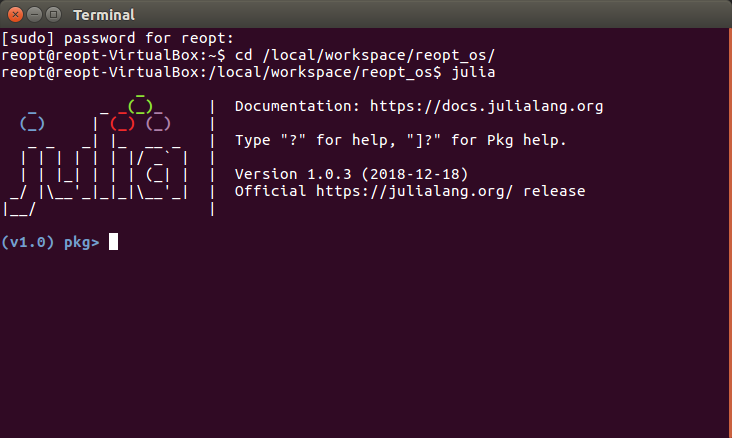
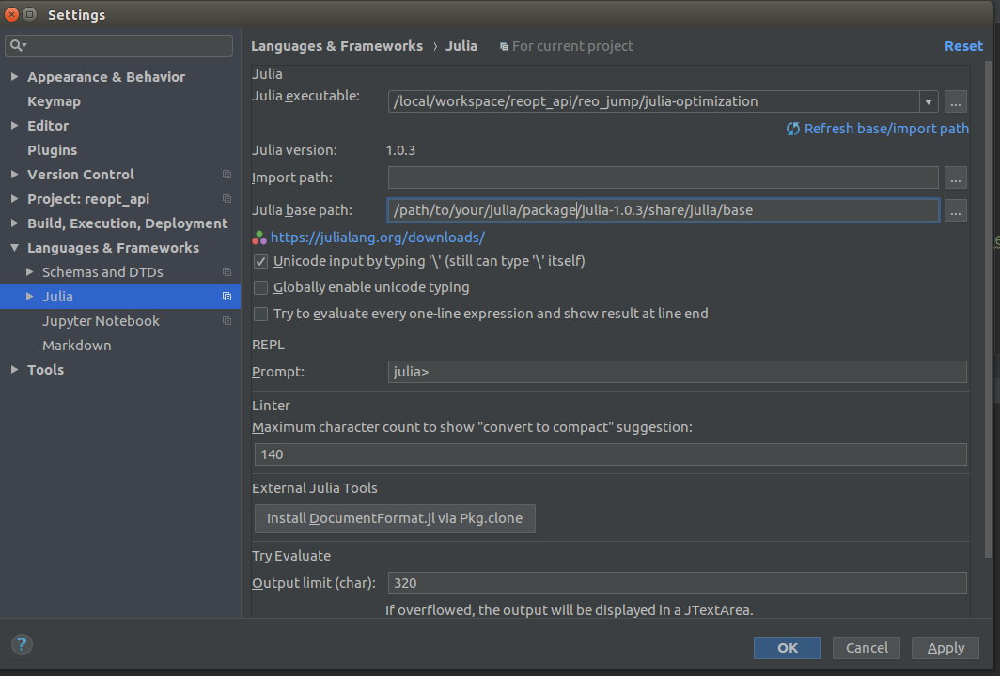
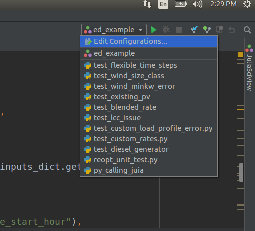
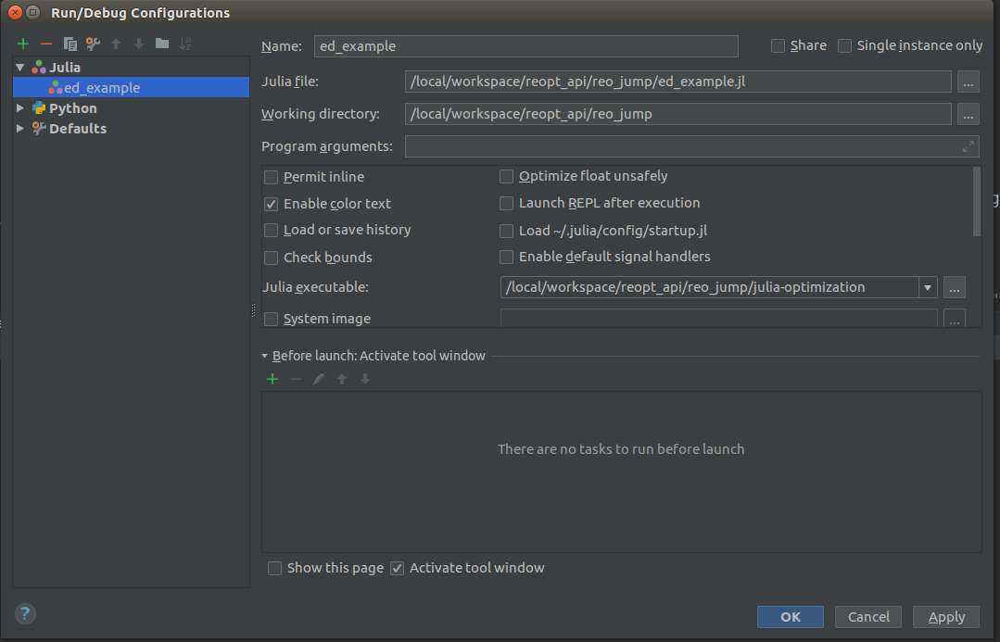

## REopt open-source JuMP set-up 

### Step 0: 
- `git clone https://github.com/nrel/reopt_api.git`  
- `cd reopt_api`  
- `git checkout jump_dev`  
- There are several paths to keep track of during this installation, which will be referred to using these generic names:
1. `PROJECT_PATH` - The location where you clone the REopt code, i.e, `/local/workspace/'
2. `REOPT_PATH` - The location of the REopt_API code, i.e, `$PROJECT_PATH/reopt_api`
3. `CONDA_PATH` - The location of your miniconda installation, i.e, `$PROJECT_PATH/miniconda`
4. `JULIA_PATH` - The location of your Julia 1.03 installation, i.e, `$PROJECT_PATH/julia-1.0.3`

### Step 1: Miniconda Installation
- Download the Python 2.7 version (64-bit(x86)) installer from

     `https://docs.conda.io/en/latest/miniconda.html`

- In bash terminal, type the command:

     `bash Miniconda-latest-Linux-x86_64.sh`

- Follow the prompts on the installer screens
- To make the changes take effect, close and then re-open your Terminal window.

### Step 2: Creating virtual environment for Julia in  **Python**

- In a new bash terminal, run the following command to create a new virtual environment named *reo_jump*:  

    `conda create --name reo_jump python=2.7.15`
  
 - Activate the newly created python virtual environment using the command:  

    `conda activate reo_jump`

- Install the required packages for REopt_OpenSource project using the following command, where `$REOPT_PATH` is replaced by the location of your REopt api root defined in Step 0.
    `pip install -r $REOPT_PATH/requirements.txt`

- Install python's julia package for calling julia functions in python  

    `conda install -c conda-forge julia`  
    `python2 -m pip install julia`

- Adding the python virtualenv (_reo_jump_)  to the ipython notebook, run the following set of commands:  
    `pip install ipykernel`  
    `ipython kernel install --user --name=reo_jump`
 
#### Step 2.1 Installing Julia programming language
- Open a new terminal
- Navigate to installation location
- Linux users: Either download from <a href="https://julialang.org/downloads" target="blank">here</a> or:  

     `wget https://julialang-s3.julialang.org/bin/linux/x64/1.0/julia-1.0.3-linux-x86_64.tar.gz`

    `tar xvzf julia-1.0.3-linux-x86_64.tar.gz`
- Mac users: Go to <a href="https://julialang.org/downloads" target="blank">here</a> 
    - download .dmg 
    - manually run
    - click and drag icon to Applications
- Recall from Step 0: `$JULIA_PATH` is the generic location of wherever you installed julia: `~/julia-1.0.3/`
- Add `$JULIA_PATH/bin/julia` to the `PATH`: `export PATH=$JULIA_PATH/bin:$PATH`
   
- Julia configuration setup.  When setting up julia, by default a `.julia` folder is created in `$HOME`:
     `cd $HOME/.julia/`
     `mkdir config`

- Create a file named startup.jl in the newly created folder (you will need a text editior like gedit to create a file)
- Add the following to your `$HOME/.julia/config/startup.jl`, obtaining the path to python and juptyer by: `which python` while in your activated conda environment.  Note that $MINICONDA_PATH should be replaced by the location of your anaconda or miniconda installation.

    `ENV["PYTHON"] = "$MINICONDA_PATH/envs/reo_jump/bin/python"`  
    `ENV["JUPYTER"] = "$MINICONDA_PATH/envs/reo_jump/bin/jupyter"`

- In Julia >= 0.7, above two paths to `libpython` have to match exactly in order for PyJulia to work. Open the terminal window and type `julia` to launch the Julia interactive command-line read-eval-print-loop (REPL).  
- For configuring PyCall.jl to use project specific Python interpreter (which is `$MINICONDA_PATH/envs/reo_jump/bin/python`), run the following commands in the Julia REPL opened in previous step:  

    `ENV["PYTHON"] = "$MINICONDA_PATH/envs/reo_jump/bin/python"`  
    `using Pkg`  
    `Pkg.add("PyCall")`  
    `Pkg.build("PyCall")`    

### Step 3: IJulia and JuMP Installation

- Open a terminal and launch julia with the command: `julia`
- Install IJulia with the following commands:  
     `using Pkg`  
     `Pkg.add("IJulia")`  
     `Pkg.add("JuMP")`  
- Further help on IJulia notebook:  [here](https://github.com/JuliaLang/IJulia.jl)

### Step 4 Installing Solvers
- Execute the following set of commands:  
     `Pkg.add("Cbc")`  
     `Pkg.add("GLPK")`  
     `Pkg.add("MathOptInterface")`   

#### Step 4.1 Additional dependencies to install (outside of Julia environment)

- for linux users:
    `sudo apt-get update`  
    `sudo apt-get install gfortran`
 
- for mac users:
    `conda install -c anaconda gfortran_osx-64`

### Step 5: Installing **Julia Plugin** for PyCharm
- Open pycharm
- Go to `File -> Settings -> Plugins -> Browse Repositories`
- Search `Julia`
- install the Julia plugin and restart Pycharm

  #### Step 5.1: Setting up julia project environment inside reopt_api folder
- Open a new terminal
- Navigate to `$REOPT_PATH/reo_jump`
- Open `julia-optimization` in a text editor
- Replace the paths to reflect your paths for `$JULIA_PATH` and `REOPT_PATH`: `$JULIA_PATH/bin/julia --project="$REOPT_PATH/reo_jump/env" $@`
- Navigate to `$REOPT_PATH/reo_jump/env`, type: `julia` to activate the Julia REPL
- Type `]` to toggle to the `Pkg` specific REPL, see more [here](https://docs.julialang.org/en/v1/stdlib/Pkg/index.html)
- You will see *_(v1.0)>_* in the repl:
-   
- type the following commands:

     *_(v1.0)_*>  `activate .`  _this command will activate an environment within the current folder, `env`_
     
- You will see *_(v1.0)>_* changing to *_(env)>_* in the repl.  You've setup the environment, and now will define packages for that environment:

     *_(env)_*>  `status`  
     *_(env)_*>  `add Cbc`  
     *_(env)_*>  `add GLPK`  
     *_(env)_*>  `add MathOptInterface`  
     *_(env)_*>   `add Interface`  

  #### Step 5.2: Setting up project interpreter for running Julia file inside PyCharm
- go to `File->Settings->Languages & Frameworks->Julia`
-   
- Enter the paths in the  _Julia executable_ and _Julia base path_ as shown the above snapshot
- Hit _Apply_ and _OK_
- Click on the drop-down toward the right (up) of the PyCharm main screen (shown in the following  image):  
-   
- Click on _Edit Configurations and hit on + button.
- Pick _Julia_ in the options which show up when you click + button
- fill out the details as given in the following snapshot:  
-   
- __ed_example.jl__ file is an example julia script located inside reo_jump folder
- __julia-optimization__ was created in previous steps
- Hit _Apply_ and _OK_  

  #### Step 5.3: Setting up python project interpreter in PyCharm
  - go to `File->Settings->Project->Project Interpreter`
  - Add existing project interpreter, point to `$MINICONDA_PATH/bin/python`
  - Hit _Apply_ and _OK_

